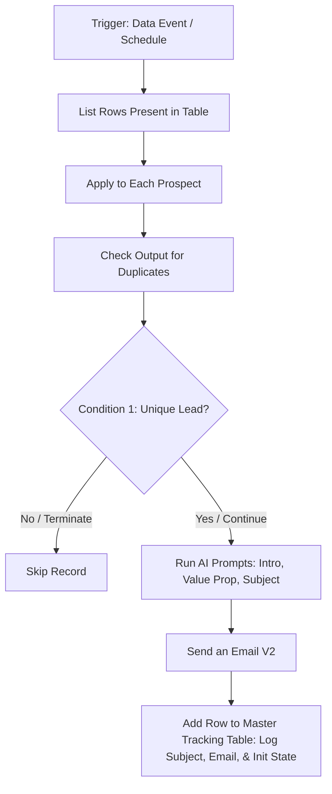

# 1. First Mail: AI Outbound Automation Flow

## Overview
This workflow automates the first touchpoint of a Go-To-Market (GTM) outbound sequence. It pulls lead data, verifies deduplication to protect sender reputation, and uses a modular AI prompt chain to generate hyper-personalized emails at scale. 

Crucially, this flow acts as the foundational data generator for the entire sequence. It documents exact outputs (like the AI-generated subject line) and initializes the lifecycle state (such as reply/bounce-back monitoring) so subsequent follow-ups can operate safely and thread seamlessly.

## Workflow Diagram

## Step-by-Step Logic

* **1. Data Ingestion & Deduplication:** Fetches prospect records and cross-references them against historical logs. If already contacted, the loop skips the record to protect domain reputation.
* **2. Grounded AI Personalization:** Uses a modular prompt sequence to generate the email content. 
  * **System Context:** The AI is strictly prompted with a predefined list of the exact solutions and services we provide, mapping our value proposition without hallucinating features.
  * **Hyper-Personalization:** Dynamically injects structured lead data (Prospect Role, Company Name, Region, and Industry) to craft a highly relevant opening hook and a tailored pitch.
  * **Subject Line:** Synthesizes the generated body to create a natural-sounding, unique subject line.
* **3. Dispatch:** Automatically compiles the generated variables into the email body and sends the personalized outreach via Exchange.
* **4. State & Output Logging (Crucial Step):** Logs the successful send back into the Excel master ledger. 
  * **Thread Matching:** Documents the exact **`To Address`** and the AI-generated **`Subject Line`** so downstream flows can reply in the same thread.
  * **Guardrail Initialization:** Sets the **`Replied`** column to `False`. This establishes the baseline for a parallel listener (or CRM sync) to flag inbound replies or bounce-backs (NDRs), ensuring future follow-ups are safely cancelled if the prospect engages or the inbox is dead.

## Instructions & Deployment Setup
To deploy this flow in your own Power Automate environment:
1. **Connections Required:** Excel Online (or Dataverse), Office 365 Outlook, and AI Builder (or OpenAI API connection).
2. **Setup the Ledger:** Ensure your Master Tracking Table has columns to catch the outputs: `Prospect_Email`, `Generated_Subject_Line`, `Sent_Status`, `Follow_Up_Stage`, and critically, `Replied` (Boolean/Text).

## Key GTM Value
* **Precision Targeting:** Contextualizes outreach based on region and role while strictly aligning the messaging with actual company solutions.
* **System Architecture:** By explicitly initializing the `Replied = False` state and outputting the exact sent variables back to Excel, this flow successfully bridges the gap between disparate automation runs.
* **Data Hygiene:** Hard-coded deduplication prevents double-contacting leads at the point of entry.
