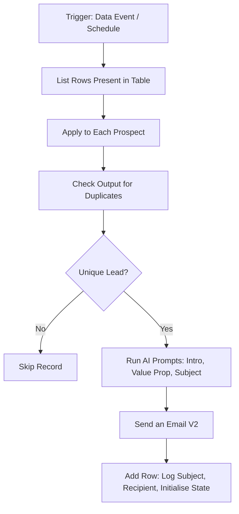

# 1. First Mail — AI Outbound Automation Flow

The first touchpoint. Pulls lead data, checks it hasn't been contacted before, generates a personalised email, sends it, and writes back everything the later flows will need.

This flow is the foundation for the sequence. The subject line and recipient it logs are what Flows 2 and 3 use to find the thread, and the state it initialises is what they check before sending.

---

## Flow

---

## Steps

**1. Data ingestion and deduplication**
Fetches prospect records and cross-references against the historical log. Already contacted, the loop skips the record. This is the only thing preventing a lead being double-contacted, so it runs before anything expensive happens.

**2. AI generation**
A modular prompt sequence rather than one call:

- **Grounding** — the system prompt contains a fixed list of the services actually offered, so the model maps value propositions to real capabilities rather than inventing features that sound plausible for the business.
- **Personalisation** — prospect role, company name, region, and industry are injected as structured data to shape the opening hook and the pitch.
- **Subject line** — generated last, from the body, so it reflects what the email actually says.

**3. Dispatch**
Compiles the generated variables into the email body and sends via Outlook.

**4. State and output logging**
Writes back to the Excel ledger. Two things matter here:

- **Thread matching data** — the recipient address and the AI-generated subject line, which is how Flows 2 and 3 locate this message in Sent Items to reply into the thread.
- **State initialisation** — sets `Replied` to `False`. Both follow-ups check this field before sending. See the limitation below.

---

## Deployment

**Connections:** Excel Online (or Dataverse), Office 365 Outlook, AI Builder (or OpenAI API).

**Ledger columns:** `Prospect_Email`, `Generated_Subject_Line`, `Sent_Status`, `Follow_Up_Stage`, `Replied`.

---

## Limitations

**`Replied` is initialised here but never updated automatically.** This flow sets it to `False`; the follow-ups read it; nothing writes `True`. In practice replies and bounce-backs were flagged manually in the ledger between runs. Automating it needs a separate listener flow triggering on inbound mail.

**Subject-line collisions are possible.** Thread matching depends on the AI generating a distinct subject per prospect. Two contacts at the same company could produce the same subject and the same recipient domain, which would make the Sent Items search ambiguous. Logging the Message ID returned by the send action would remove the risk entirely.

**No output validation.** If the AI returns something empty or malformed, it sends anyway.
