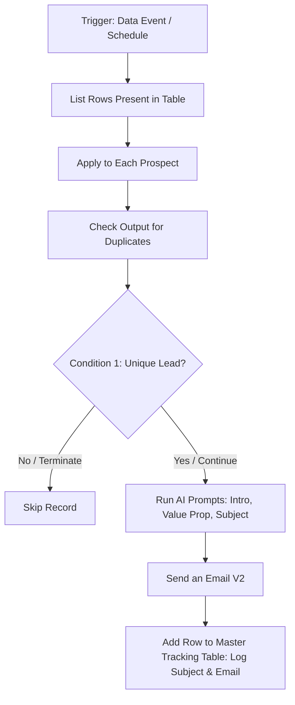

# 1. First Mail: AI Outbound Automation Flow

## Overview
This workflow automates the first touchpoint of a Go-To-Market (GTM) outbound sequence. It pulls lead data, verifies deduplication to protect sender reputation, and uses a modular AI prompt chain to generate hyper-personalized emails at scale. 

Crucially, this flow acts as the foundational data generator for the entire sequence, documenting exact outputs (like the AI-generated subject line) back to the database so subsequent follow-ups can seamlessly thread into the same email chain.

## Workflow Diagram

## Step-by-Step Logic

* **1. Data Ingestion & Deduplication:** Fetches prospect records and cross-references them against historical logs. If already contacted, the loop skips the record to protect domain reputation.
* **2. Grounded AI Personalization:** Uses a modular prompt sequence to generate the email content. 
  * **System Context:** The AI is strictly prompted with a predefined list of the exact solutions and services we provide. This ensures it maps the value proposition accurately without hallucinating non-existent features.
  * **Hyper-Personalization:** The prompts dynamically inject structured lead data (Prospect Role, Company Name, Region, and Industry) to craft a highly relevant opening hook and a tailored pitch.
  * **Subject Line:** Synthesizes the generated body to create a natural-sounding, unique subject line.
* **3. Dispatch:** Automatically compiles the generated AI variables into the email body and sends the personalized email via Exchange.
* **4. State & Output Logging:** Logs the successful send back into the Excel master ledger. Crucially, it documents the exact **`To Address`** and the AI-generated **`Subject Line`**. Recording these specific outputs is mandatory, as it allows the downstream follow-up flows to search the Outlook 'Sent Items' folder and reply directly in the same thread.

## Instructions & Deployment Setup
To deploy this flow in your own Power Automate environment:
1. **Connections Required:** Excel Online (or Dataverse), Office 365 Outlook, and AI Builder (or OpenAI API connection).
2. **Licensing:** Premium Power Automate licenses are required for Dataverse/HTTP connectors, and **AI Builder credits** (or a paid OpenAI API key) are required to execute the generative AI prompt steps.
3. **Setup the Ledger:** Ensure your Master Tracking Table has columns to catch the outputs: `Prospect_Email`, `Generated_Subject_Line`, `Sent_Status`, and `Follow_Up_Stage`.

## Optional Enhancement: Human-in-the-Loop (HITL) Individual Approval
For campaigns requiring strict quality control, an individual approval step (via Microsoft Teams Adaptive Cards) can be inserted immediately prior to dispatch. This routes the AI-generated draft to the assigned GTM rep for a manual review. 
* *Note: While excellent for brand safety on high-value enterprise accounts, this step is omitted from the core architecture as it creates a manual bottleneck and can make high-volume execution tedious.*

## Key GTM Value
* **Precision Targeting:** Contextualizes outreach based on region and role while strictly aligning the messaging with actual company solutions.
* **Data Continuity:** By outputting the exact sent variables (Subject Line and Email Address) back to Excel, this flow successfully bridges the gap between disparate automation runs, enabling human-like threaded follow-ups later.
* **Data Hygiene:** Hard-coded deduplication prevents double-contacting leads and protects domain health.
