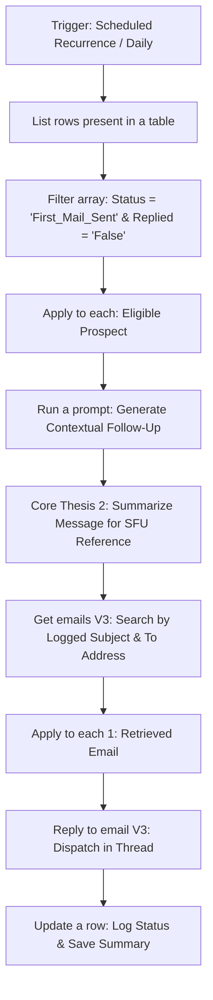

# 2. First Follow-Up: Threaded AI Outbound Flow

## Overview
This workflow governs the second touchpoint of the Go-To-Market (GTM) outbound sequence. Operating completely autonomously on a daily schedule, it scans the centralized master database for eligible prospects. It verifies no replies or bounce-backs have been received, generates a contextual follow-up, summarizes that message for future reference, and seamlessly appends the reply into the original Outlook email thread.

## Workflow Diagram

## Step-by-Step Logic

* **1. Scheduled Autonomous Trigger (`Recurrence`):** Runs automatically on a daily cadence, acting as a silent background engine to review the master tracking ledger.
* **2. Data Ingestion & Deliverability Guardrail (`List rows` & `Filter array`):** Fetches the shared Excel database and isolates prospects who received the first email and passed the cooldown period. **Crucially, it verifies the `Replied` column is empty/false. If a human reply OR an automated bounce-back/undeliverable notification was logged, the follow-up is immediately cancelled.**
* **3. AI Content Generation & Summarization (`Run a prompt` & `Core Thesis 2`):** 
  * **Run a prompt:** Generates a concise, polite follow-up (the "bump").
  * **Core Thesis 2:** Processes the generated text to create a condensed summary. This summary is strictly created so the Second Follow-Up (SFU) AI has historical context.
* **4. Thread Identification (`Get emails V3`):** Queries the Office 365 Outlook 'Sent Items' folder using the **To Address** and **Generated Subject Line** logged by Flow 1 to locate the original message ID.
* **5. Threaded Dispatch (`Reply to email V3`):** Uses the extracted Message ID to send the AI-generated follow-up as a direct reply to the original email.
* **6. State Update (`Update a row`):** Modifies the prospect's record in the central Excel ledger. It updates the status and writes the Core Thesis 2 summary directly into a dedicated column for the SFU sequence.

## Key GTM Value
* **Domain Reputation Protection:** By categorizing bounce-backs alongside human replies to halt the sequence, the architecture actively protects the domain's sender score from being penalized for repeatedly hitting invalid addresses.
* **Autonomous Scaling:** By utilizing a scheduled trigger, the follow-up process becomes a true "set-and-forget" machine.
* **Cross-Flow Memory:** Using `Core Thesis 2` to summarize and log the message bridges the context gap between disparate workflows.
