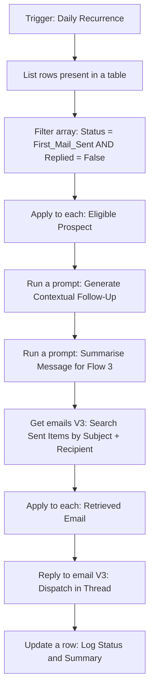

# 2. First Follow-Up — Threaded AI Outbound Flow

The second touchpoint. Runs on a daily schedule, finds prospects due for a follow-up, checks they haven't replied, generates a contextual bump, and appends it to the original email thread.

It also writes a summary of its own message back to the ledger, so the final follow-up has context without carrying the full history.

---

## Flow

---

## Steps

**1. Scheduled trigger**
Daily recurrence. No human involvement in starting it — it reviews the ledger and acts on whatever is eligible.

**2. Filter for eligibility**
Isolates prospects who received the first email, have passed the cooldown period, and have `Replied` set to `False`. If a reply or a bounce-back was flagged, the follow-up is skipped.

**3. AI generation and summarisation**
Two calls. The first writes a short, polite follow-up. The second condenses it into a summary that is written to the ledger for Flow 3 to use. Summarising rather than storing the full text keeps the prompt for the final message focused on what was said rather than on the exact wording.

**4. Thread identification**
Searches the Outlook Sent Items folder using the recipient address and the subject line that Flow 1 logged, and extracts the Message ID.

**5. Threaded dispatch**
Replies to that message, so the follow-up lands in the same thread rather than as a fresh email.

**6. State update**
Updates the prospect's row: new status, and the summary written to its own column for Flow 3.

---

## Why threading

A follow-up arriving as a separate email reads as automated. Appended to the original thread, it reads as a person following up on something they sent. That is the entire reason for the Sent Items search — it would be far simpler to just send a new email.

---

## Limitations

**The `Replied` check depends on manual maintenance.** The filter reads the column correctly, but nothing in these flows writes to it. Replies and bounce-backs were reviewed and flagged by hand in the ledger between runs. The automated version needs a listener flow: trigger on new mail, match the sender against the ledger, set `Replied` to `True`. Bounce-backs would match on NDR sender patterns such as `postmaster@` or `mailer-daemon@`, and on delivery-status content type.

**Thread matching is not guaranteed unique.** Searching Sent Items by subject and recipient works but could return the wrong message if subject lines collide. Storing the Message ID at send time in Flow 1 would be the correct fix.

**Race condition on late replies.** If a prospect replies between the eligibility check and the send, the follow-up still goes out. A narrow window, but real.
