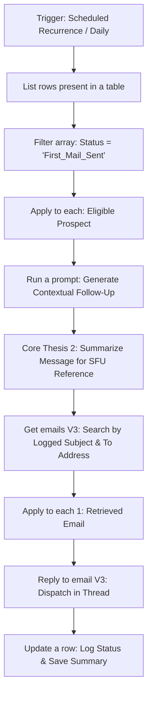

# 2. First Follow-Up: Threaded AI Outbound Flow

## Overview
This workflow governs the second touchpoint of the Go-To-Market (GTM) outbound sequence. Operating completely autonomously on a daily schedule, it scans the centralized master database (the same ledger used by all three flows) for eligible prospects. It generates a contextual follow-up, summarizes that message for future reference, and seamlessly appends the reply into the original Outlook email thread.

## Workflow Diagram

## Step-by-Step Logic

* **1. Scheduled Autonomous Trigger (`Recurrence`):** The flow runs automatically on a daily cadence, acting as a silent background engine to review the master tracking ledger.
* **2. Data Ingestion & Filtering (`List rows` & `Filter array`):** Fetches the single, shared Excel/Dataverse database and isolates prospects who have successfully received the first email and have passed the required cooldown period (e.g., 7 days).
* **3. AI Content Generation & Summarization (`Run a prompt` & `Core Thesis 2`):** 
  * **Run a prompt:** Generates a concise, polite follow-up (the "bump") referencing the initial outreach.
  * **Core Thesis 2:** Processes the generated text to create a condensed summary of the FFU's core message. This summary is strictly created so the Second Follow-Up (SFU) AI has historical context to refer back to later.
* **4. Thread Identification (`Get emails V3`):** Queries the Office 365 Outlook 'Sent Items' folder using the **To Address** and **Generated Subject Line** logged by Flow 1 to locate the exact original message and extract its backend Message ID.
* **5. Threaded Dispatch (`Reply to email V3`):** Uses the extracted Message ID to send the AI-generated follow-up as a direct reply to the original email, leveraging prior context and keeping the prospect's inbox tidy.
* **6. State Update (`Update a row`):** Modifies the prospect's record in the central Excel ledger. It updates the status to reflect the completed follow-up and **writes the Core Thesis 2 summary directly into a dedicated column**, ensuring the data is ready and waiting for the final SFU sequence.

## Instructions & Deployment Setup
To deploy this flow in your own Power Automate environment:
1. **Connections Required:** Excel Online (or Dataverse), Office 365 Outlook, and AI Builder (or OpenAI API connection).
2. **Centralized Database:** Ensure all three flows in this repository point to the exact same Excel file/Dataverse table to maintain a single source of truth.
3. **Setup the Ledger for SFU:** Verify your table has a specific text column (e.g., `FFU_Summary_Context`) to catch the output of the **Core Thesis 2** step.

## Key GTM Value
* **Autonomous Scaling:** By utilizing a scheduled trigger, the follow-up process becomes a true "set-and-forget" machine, allowing sales reps to focus on warm replies.
* **Cross-Flow Memory:** Using `Core Thesis 2` to summarize and log the message bridges the context gap between disparate workflows, ensuring the AI "remembers" what it previously pitched without needing to process massive chains of text.
* **Data Continuity:** Relying on a single master ledger guarantees that the First Mail, First Follow-Up, and Second Follow-Up sequences execute in perfect synchronization.
