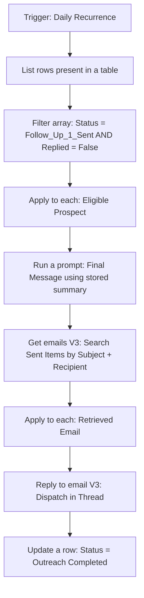

# 3. Second Follow-Up — Final Threaded Sequence

The last touchpoint. Reads the summary Flow 2 wrote to the ledger, generates a final message informed by what was already said, appends it to the same thread, and closes the prospect's lifecycle so nothing further is sent.

---

## Flow

---

## Steps

**1. Scheduled trigger**
Daily recurrence, scanning for prospects who have reached the end of the sequence timeline.

**2. Filter for eligibility**
Isolates prospects who received the first follow-up, have passed the interval, and have `Replied` set to `False`.

**3. Context-aware generation**
The system prompt includes the summary Flow 2 wrote to the ledger. This is the point of the whole cross-flow design: without it, the final message would repeat the previous email's value proposition, which is exactly what makes a sequence read as automated. With it, the model can acknowledge what was already said and take a different angle.

**4. Thread identification**
Searches Sent Items using the recipient address and the original subject line to find the chain.

**5. Threaded dispatch**
Replies into the thread, keeping all three messages consolidated in one conversation.

**6. Lifecycle closure**
Sets the status to `Outreach Completed`. This is what stops the prospect being picked up again — without a terminal state, a scheduled flow scanning a ledger will eventually re-process records it has already handled.

---

## Why the summary matters

This flow is the only one that has to know what came before. Flow 1 has no history and Flow 2 only needs to know that Flow 1 ran. Flow 3 needs the actual content, because the failure mode of a third cold email is repeating yourself.

Passing a summary rather than the full prior text keeps the prompt focused and avoids carrying the entire thread into every call.

---

## Limitations

**The `Replied` check depends on manual maintenance.** Same as Flow 2 — the column is read correctly but written by hand. An inbox listener flow would automate it.

**Thread matching by subject and recipient is not collision-proof.** Storing the Message ID from Flow 1's send would be more reliable.

**No validation on the generated message.** If the AI returns something empty or malformed, it sends.

**Summary quality is unverified.** Flow 3's output is only as good as the summary Flow 2 wrote, and nothing checks that the summary was accurate or complete before it gets used.
