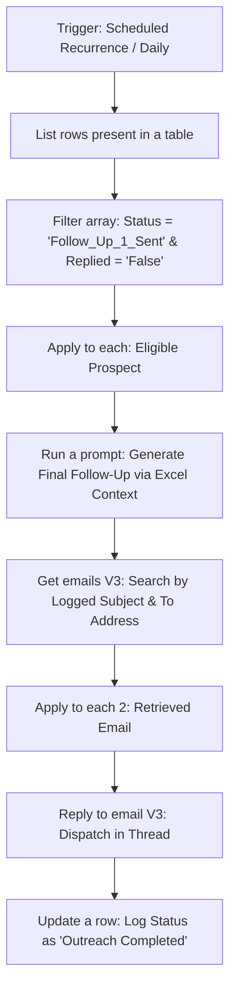

# 3. Second Follow-Up: Final Threaded AI Sequence

## Overview
This workflow governs the third and final touchpoint of the Go-To-Market (GTM) outbound sequence. Operating autonomously on a scheduled cadence, it reads the centralized master ledger, injects the historical context summarized by the First Follow-Up directly into the AI instructions, and seamlessly appends a final message into the ongoing email thread before closing out the prospect's lifecycle.

## Workflow Diagram

## Step-by-Step Logic

* **1. Scheduled Autonomous Trigger (`Recurrence`):** Runs on a daily schedule, scanning the master tracking ledger for prospects who have reached the end of the sequence timeline.
* **2. Data Ingestion & Deliverability Guardrail (`Filter array`):** Isolates prospects due for the final touchpoint. **Checks the `Replied` status—if the prospect responded, or if any previous email in the chain resulted in a bounce-back, this final sequence is permanently cancelled.**
* **3. Context-Aware AI Generation (`Run a prompt`):** 
  * The AI's system instructions are configured with dynamic text mapped directly to the Excel cell containing the FFU Summary.
  * The AI utilizes this injected historical context to generate a highly relevant final message, ensuring it doesn't blindly repeat the previous email's value proposition.
* **4. Thread Identification (`Get emails V3`):** Queries Outlook's 'Sent Items' folder using the original **To Address** and **Generated Subject Line** to locate the email chain and extract the Message ID.
* **5. Threaded Dispatch (`Reply to email V3`):** Sends the final AI-generated message as a direct reply, keeping the entire three-part conversation neatly consolidated in a single inbox thread.
* **6. Final State Update (`Update a row`):** Updates the specific prospect's Excel cell status to **"Outreach Completed"**. This safely closes out their lifecycle in the automation pipeline, ensuring no further unprompted emails are sent.

## Key GTM Value
* **Fail-Safe Deliverability:** Strict bounce-back and reply-detection filtering prevents the sequence from sending tone-deaf automated follow-ups to engaged prospects or damaging domain health by emailing dead domains.
* **Cross-Flow Memory:** By injecting the Excel-based summary directly into the AI's instructions, the system successfully mimics the memory and context-recall of a human sales rep without requiring massive computational overhead.
* **Lifecycle Management:** Clearly defining an "Outreach Completed" state prevents data looping and keeps the master ledger clean for reporting and analytics.
